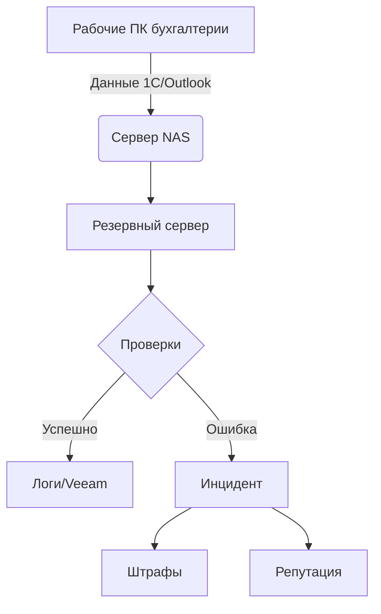

# IB_game

### **🎮 Имитационный практикум "Организационные аспекты ИБ"**  
**Инновационный формат освоения реальных рабочих ситуаций**  

---

#### **🔍 Ключевые особенности**  

**1. Право на ошибку с обратной связью**  
- Совершили провал? Система **детально разберёт**, где вы ошиблись:  
  *"Вы выбрали RPO=24 часа для бухгалтерии → нарушили ст. 120 НК РФ → штраф 50 000 ₽. Нужно было учитывать сроки сдачи отчётности"*  
- После каждого "увольнения" — **аналитическая справка** с рекомендациями  

**2. Реальные рабочие контексты**  
- Взаимодействуете не с условными "студентами-актёрами", а с **реалистичными NPC**:  
  - Бухгалтер **действует по мотивам** (боится штрафов)  
  - Техник **саботирует** при низкой репутации  
  - Руководство **меняет приоритеты** после проверок  

**3. Социальная динамика**  
- Ваши решения влияют на:  
  - **Репутацию** в коллективе (от "надёжного специалиста" до "дилетанта")  
  - **Карьерный рост** (от стажёра до директора по ИБ)  
  - **Бюджет отдела** (штрафы сокращают финансирование)  

---

### **🎯 Чему научит практикум**  
#### **Soft Skills**  
- Как **объяснять** технические требования нетехническим отделам  
- Как **отстаивать** бюджет перед руководством  
- Как **распознавать** саботаж и человеческий фактор  

#### **Hard Skills**  
- Составление **регламентов** под реальные бизнес-процессы  
- Расчёт **RPO/RTO** с учётом законодательства  
- Анализ **инцидентов** с привязкой к бизнес-рискам  

---

### **📌 Пример обучения через ошибки**  

**Сценарий**: Вы разрешили производству использовать личные флешки.  

**Последствия**:  
1. Через 3 игровых дня — вирусная атака → простой цеха  
2. Руководство снижает ваш рейтинг на 15 пунктов  
3. IT-отдел требует ужесточить политики  

**Разбор ошибки**:  
- **Что было не так**: Игнорирование п. 5.3 внутреннего регламента  
- **Как исправить**: Внедрить DLP-систему (+20% к бюджету) или запретить флешки (-10 к репутации производства)  
- **Нормативная база**: ФСТЭК Приказ №239, ст. 13.11 КоАП  

---

### **🕹️ Формат обучения**  
- **Самостоятельно**: Проходите модули в удобном темпе  
- **С повторами**: 10+ попыток для каждого кейса  
- **С инсайтами**: После каждого провала — пояснения:  
  *"Вы потеряли данные кадрового учёта → это нарушает ст. 18 ФЗ №152. Нужно было настроить ежедневное шифрованное копирование"*  

---

### **📊 Что отличает этот практикум**  
| Обычное обучение  | Наш практикум  |  
|-------------------|---------------|  
| Теория без контекста | Рабочие ситуации с последствиями |  
| Оценки преподавателя | Автоматизированный разбор ошибок |  
| Групповые ролевые игры с общей оценкой | Персонализированные отчёты об ошибках игрока |  

---


> Каждый выбор имеет последствия — каждая ошибка становится уроком.


### **📜 Официальное предложение о должности**  
**Компания**: ООО "СтальПрогресс"  
**Должность**: Руководитель отдела информационной безопасности  
**Тип занятости**: Полная (40 часов/неделя)  
**Зарплата**: От 150 000 ₽ (по результатам испытательного срока)  

---

### **🔐 Ключевые обязанности**  
1. **Обеспечение ИБ-процессов**:  
   - Внедрение и контроль:  
     - Резервного копирования (RPO/RTO в рамках SLA)  
     - Антивирусной защиты (100% покрытие рабочих станций)  
     - Парольной политики (соответствие ФЗ №152 и GDPR)  
   - Реагирование на инциденты (макс. 2 часа на критичные угрозы).  

2. **Работа с отделами**:  
   - Проведение аудитов (1 раз/квартал для бухгалтерии, кадров, производства).  
   - Обучение сотрудников (4 часа/месяц по киберграмотности).  

3. **Документооборот**:  
   - Подготовка регламентов (шаблоны предоставляются).  
   - Отчётность перед руководством (еженедельные сводки).  

4. **Управление бюджетом**:  
   - Распределение 400 000 ₽/месяц (с учётом штрафов за нарушения).  
   - Оптимизация затрат (снижение расходов на 10% = +5% к премии).  

---

### **⚖️ Условия**  
- **Испытательный срок**: 3 месяца (репутация в ключевых отделах ≥60).  
- **Критерии успеха**:  
  - 0 критичных инцидентов за квартал → +20% к бонусу.  
  - Снижение ИБ-рисков на 30% → карьерный рост до *Директора по ИБ*.  
- **Санкции**:  
  - Штрафы из личного бонусного фонда за:  
    - Нарушение RPO (>12 часов) → -15 000 ₽.  
    - Утечку персональных данных → -50 000 ₽.  

---

### **💼 Что мы предлагаем**  
- **Гибкий график**: Возможность ускорять/замедлять время в игре.  
- **Развитие**: Прокачка навыков за реальные достижения (см. систему XP).  
- **Бонусы**:  
  - Доступ к "секретным" диалогам при репутации >80.  
  - Кастомный аватар после 6 месяцев работы.  

---

### **📌 Особые требования**  
1. **Технические навыки**:  
   - Понимание RAID, Active Directory, Veeam.  
   - Базовые знания НК РФ/КоАП (для расчёта штрафов).  

2. **Личные качества**:  
   - Умение отличать *саботаж техника* от *его некомпетентности*.  
   - Готовность объяснять бухгалтерии, что такое RPO, без мата.  

3. **Лояльность**:  
   - Принятие корпоративных ценностей:  
     *"Безопасность — это когда все недовольны, но данные целы"*.  

---

### **📝 Как принять офер**  
1. Нажмите "Принять" в интерфейсе игры.  
2. Пройдите вводный инструктаж (15 мин).  
3. Начните с модуля **Резервное копирование** → отдел бухгалтерии.  

**P.S.** Отдел кадров предупреждает:  
*"Если потеряете трудовые договоры — ваша цифровая голова полетит в корзину раньше, чем вы скажете 'RTO'."*  

--- 


### **👤 Описание персонажа игрока (Руководитель отдела ИБ)**

---

#### **🔹 Основные характеристики**
**Имя**: По выбору игрока (по умолчанию — *Александр Ковалёв*)  
**Должность**: Руководитель отдела информационной безопасности  
**Возраст**: 35 лет  
**Опыт**: 7 лет в ИБ (из них 2 года на текущем предприятии)  
**Стиль управления**: Гибкий (игрок выбирает подход: *дипломатичный*, *технократичный* или *авторитарный*)  

---

#### **📊 Навыки (базовые значения)**
| Навык               | Уровень | Влияние на геймплей                     |
|----------------------|---------|------------------------------------------|
| **Техническая экспертиза** | 70/100  | Разблокирует сложные варианты решений    |
| **Переговоры**       | 60/100  | Снижает штрафы к репутации в диалогах    |
| **Бюджетирование**   | 50/100  | Позволяет укладываться в лимиты          |
| **Работа с командой**| 40/100  | Уменьшает риск саботажа техника          |

---

#### **🎭 Психологический портрет**
- **Сильные стороны**:  
  - Аналитический склад ума — видит риски там, где другие их игнорируют.  
  - Способен объяснить сложные термины простыми словами (*если игрок выбирает дипломатичный стиль*).  
- **Слабые стороны**:  
  - Склонен переоценивать технические решения в ущерб человеческому фактору (*при технократичном подходе*).  
  - Не любит бюрократию — может пропустить оформление документов (*риск штрафов при проверках*).  

---

#### **💼 Рабочие принципы**  
*(Определяются выбором игрока)*  
1. **Дипломат**:  
   - *"Главное — найти компромисс, даже если это дороже"*  
   - Бонус: +20% к скорости согласования документов  
   - Риск: Перерасход бюджета на 10-15%  

2. **Технократ**:  
   - *"Есть регламент — ему и следуем"*  
   - Бонус: -30% к техническим ошибкам  
   - Риск: -15 к репутации у "гуманитарных" отделов  

3. **Авторитарный**:  
   - *"Я сказал — значит так"*  
   - Бонус: +25% к скорости выполнения задач  
   - Риск: Саботаж техника (+40% вероятность)  

---

#### **📌 Уникальные механики**
- **Карта репутации**:  
  Влияние на ключевые отделы отображается в реальном времени:  
  ```mermaid
  pie 
      title Репутация игрока
      "Бухгалтерия" : 65
      "IT" : 50
      "Руководство" : 70
      "Производство" : 30
  ```

- **Система стресса**:  
  Каждый провал добавляет +10% к *уровню стресса*. При 100%:  
  - Снижается эффективность (-20% ко всем навыкам)  
  - Возможны ошибочные решения (*игрок видит "затемнённые" варианты ответов*)  

---

#### **💬 Пример диалога (отражает характер)**
**Сцена**: Обсуждение инцидента с руководством  
- **Дипломат**:  
  *"Кирилл Викторович, мы столкнулись с проблемой, но уже готовы решения. Давайте обсудим варианты."*  
- **Технократ**:  
  *"По пункту 4.2 регламента, это классический случай нарушения RPO. Требуются изменения в политике бэкапов."*  
- **Авторитарный**:  
  *"Это недопустимо. Немедленно увеличиваем частоту копирования, и чтобы больше такого не было!"*  

---

#### **📈 Прокачка персонажа**
- **Повышение навыков**:  
  За успешные задания игрок получает очки опыта (XP).  
  *Пример: 50 XP для улучшения "Переговоров" с 60 → 70.*  
- **Карьерный рост**:  
  При репутации >80 у руководства — возможность стать *Директором по ИБ* (+30% к бюджету).  

---

#### **⚡ Важные детали**
- **Внешность**: Настраивается (от *строгого костюма* до *худи с принтом "No SQL"*)  
- **Фразы-клише**:  
  - *"Безопасность — это процесс, а не результат"*  
  - *"Я не параноик, просто реальность превзошла худшие ожидания"*  
- **Секретная черта**:  
  Если игрок 3 раза подряд выбирает технократичный стиль → разблокируется скрытый навык *"Машинальное цитирование ISO 27001"* (+10 к авторитету в IT).  

---
### **📈 Система прокачки навыков и эффективности персонажа**

#### **1. Механика роста навыков**
**Базовые правила:**
- За каждый **правильный выбор** в диалогах/решениях игрок получает **+1-3 XP** к соответствующему навыку.
- **Критерии "правильности"** зависят от контекста:
  - *Технические решения*: соответствие регламентам, минимизация рисков.
  - *Диалоги*: улучшение отношений с NPC, выполнение их запросов.

**Формула для XP:**
```
XP_за_действие = Базовый_XP × Модификатор_сложности × Модификатор_стиля
```
- **Базовый XP**: 1 (простое действие), 2 (среднее), 3 (сложное).
- **Модификатор сложности**:
  - Обычная задача: 1.0
  - Критичная (например, предотвращение инцидента): 1.5
- **Модификатор стиля**:
  - Дипломатичный: +0.2 к *Переговорам*
  - Технократичный: +0.2 к *Технической экспертизе*
  - Авторитарный: +0.1 к *Работе с командой* (если репутация >60)

**Пример**:  
Игрок выбирает *технократичное* решение сложной задачи (база 3 XP):  
`3 × 1.5 × 1.2 = 5.4 XP` → округляется до **5 XP** к *Технической экспертизе*.

---

#### **2. Пороги улучшения навыков**
| Уровень навыка | Требуемый XP | Влияние на геймплей                     |
|----------------|--------------|------------------------------------------|
| 0-30           | 50 XP        | Блокирует продвинутые варианты решений   |
| 31-60          | 100 XP       | Открывает 50% альтернативных вариантов   |
| 61-80          | 150 XP       | +10% к эффективности в связанных задачах |
| 81-100         | 200 XP       | Даёт уникальные бонусы (см. ниже)        |

**Уникальные бонусы на максимуме**:  
- *Техническая экспертиза 100*: Автоматическое обнаружение саботажа техника.  
- *Переговоры 100*: Возможность "убедить" NPC игнорировать мелкие нарушения.  
- *Бюджетирование 100*: +15% к общему бюджету.  

---

#### **3. Расчёт эффективности**
**Формула общей эффективности**:  
```
Эффективность = (ΣУровней_навыков / 400) × 100% + Бонусы_репутации - Штрафы_стресса
```
- **ΣУровней_навыков**: Сумма значений всех 4 навыков (макс. 400).  
- **Бонусы репутации**:  
  - +5% если репутация в ключевом отделе >70.  
  - +10% если репутация у руководства >85.  
- **Штрафы стресса**:  
  - Каждые 20% стресса снижают эффективность на 5%.  

**Пример**:  
Навыки: 70 + 60 + 50 + 40 = 220  
Репутация: Бухгалтерия=75 (+5%), Руководство=80 (0%)  
Стресс: 40% (-10%)  
`Эффективность = (220/400)×100 + 5 - 10 = 55 + 5 - 10 = 50%`  

---

#### **4. Влияние эффективности на игру**
| Уровень эффективности | Последствия                                                                 |
|-----------------------|-----------------------------------------------------------------------------|
| 80-100%              | NPC сами предлагают решения, снижение штрафов на 30%                       |
| 60-79%               | Стандартный геймплей                                                       |
| 40-59%               | +20% времени на задачи, техники чаще ошибаются                             |
| <40%                 | Критичные опции блокируются (например, нельзя требовать срочного исправления) |

---

#### **5. Практические примеры**
**Сценарий 1**: Игрок корректно настраивает резервное копирование для бухгалтерии.  
- **Действие**: Выбирает оптимальные RPO/RTO (+2 XP), вежливо общается с Валентиной Петровной (+3 XP к *Переговорам*).  
- **Итог**: *Переговоры*: 60 → 63.  

**Сценарий 2**: Игрок игнорирует требования GDPR для отдела кадров.  
- **Потеря XP**: -5 к *Технической экспертизе* (нарушение регламента).  
- **Стресс**: +20% (из-за жалобы руководству).  

---

#### **6. Балансировка**
- **Скорость прокачки**:  
  - Для достижения 80+ в одном навыке требуется ~15-20 правильных решений.  
- **Наказания за ошибки**:  
  - Серьёзные провалы могут отнимать до 10 XP (чтобы избежать "накрутки").  

---

#### **🎮 Советы игроку**
1. **Специализация**:  
   Сфокусируйтесь на 1-2 навыках (например, *Техническая экспертиза* + *Бюджетирование* для минимизации рисков).  
2. **Контроль стресса**:  
   Делегируйте задачи технику (если *Работа с командой* >50), чтобы снижать стресс на 5% за задание.  
3. **Используйте бонусы**:  
   При *Эффективности >70%* можно требовать скидки у поставщиков (-10% к затратам).  

---


### **🛠️ Полная модель инцидента, репутации и инфраструктуры (на примере бухгалтерии)**

---

#### **🔧 Инфраструктурная схема**


**Ключевые компоненты:**
- **Источник данных**: ПК бухгалтера + сетевые папки (25 ГБ)  
- **Сервер бэкапов**: Veeam на Windows Server, 150 ГБ (из них 100 ГБ свободно)  
- **Мониторинг**: Скрипт PowerShell (проверка логов каждые 30 мин)  
- **Уязвимость**: Общая папка `\\NAS\BUH` открыта на запись всем  

---

### **💥 Варианты инцидента**
#### **Сценарий 1: Шифровальщик атаковал NAS**
1. **Причина**:  
   - Техник не настроил ограничение прав (саботаж/ошибка)  
   - Вирус через общую папку шифрует файлы бухгалтерии  

2. **Последствия**:  
   - Потеря данных за **18 часов** (RPO=6ч было нарушено)  
   - Бухгалтерия не может сдать **НДС** в срок  

3. **Штрафы**:  
   ```python
   # Формула штрафа
   if RPO_violation > 12h:
       штраф = 30% от суммы налога + 5000 ₽/день просрочки
   ```
   - **Пример**: НДС = 300 000 ₽ → **90 000 ₽ штраф**  

---

### **📉 Модель репутации**
**Базовые параметры:**
| Персонаж          | Вес влияния | Макс. изменение за инцидент |
|--------------------|-------------|-----------------------------|
| Бухгалтерия       | 1.5x        | ±30                         |
| IT-отдел          | 1.2x        | ±20                         |
| Руководство       | 2.0x        | ±40                         |

**Формула:**  
```
Репутация_новоя = Репутация_текущая + (Серьёзность_инцидента × Вес_персонажа × Модификатор)
```
Где:  
- **Серьёзность**:  
  - Нарушение RPO: +3 балла за каждый час сверх лимита  
  - Штраф: +1 балл за каждые 10 000 ₽  
- **Модификатор**:  
  - 1.0 — прямая вина игрока  
  - 0.5 — частичная вина (например, техник саботировал)  

---

### **📌 Пример расчёта (провал)**
**Данные:**  
- RPO нарушено на **12 часов** → 12 × 3 = 36 баллов  
- Штраф 90 000 ₽ → 9 баллов  
- **Общая серьёзность**: 45 баллов  

**Изменения репутации:**  
1. **Бухгалтерия**:  
   - Было: 60 → Стало: 60 - (45 × 1.5) = **-7.5** (округляем до **53**)  
   - *Валентина Петровна кричит: "Я же предупреждала!!!"*  

2. **IT-отдел**:  
   - Было: 70 → Стало: 70 - (45 × 0.5 × 1.2) = **43**  
   - *Сергей (IT): "Это ты плохо регламент составил!"*  

3. **Руководство**:  
   - Было: 80 → Стало: 80 - (45 × 2.0) = **-10** (минимум 20)  
   - *Кирилл Викторович: "Готовь объяснительную на совет директоров"*  

---

### **📈 Пример (успешное восстановление)**
**Действия игрока:**  
1. Обнаружил атаку через **мониторинг логов**  
2. Восстановил данные за **2 часа** (RTO=12ч не нарушен)  
3. Штрафов нет  

**Бонусы:**  
- Бухгалтерия: +15 (60 → 75)  
- IT: +10 (за оперативность)  
- Руководство: +20  

---

### **🎮 Геймплейные последствия**
#### **Если провал:**
1. **Бухгалтерия**:  
   - Отказывается сотрудничать в следующих модулях (-30% к скорости согласования)  
   - Распространяет слухи: *"Отдел ИБ — бездари!"* (-5 к общей репутации)  

2. **IT**:  
   - Требует пересмотра бюджета (+20% к стоимости услуг)  

3. **Руководство**:  
   - Снижает бюджет ИБ на 15%  

#### **Если успех:**  
1. Бухгалтерия рекомендует игрока другим отделам (+5 к стартовой репутации в новых модулях)  
2. Разблокируется диалог: *"Кирилл Викторович: Рассмотрим ваше повышение"*  

---

### **⚙️ Техническая реализация**
**Для инцидентов:**  
```python
class Incident:
    def __init__(self, module, rpo_violation, fine):
        self.reputation_impact = {
            "accounting": rpo_violation * 3 * 1.5,
            "it": (fine / 10000) * 1.2,
            "management": (rpo_violation + fine / 10000) * 2.0
        }
```

**Проверка в игре:**  
```python
if backup.restore_time > rto_limit:
    incident = Incident("бухгалтерия", restore_time - rto_limit, штраф)
    apply_reputation_changes(incident)
```

---

### **📌 Итоговые правила для всех модулей:**
1. **Репутация** — **нелинейная**:  
   - Падает быстрее, чем растёт (коэф. 1.5x для негатива)  
2. **Штрафы** — **каскадные**:  
   - Провал в бухгалтерии → повышенные требования в других отделах  
3. **Связи между NPC**:  
   - Если репутация у IT <40 → техник саботирует чаще  

---

### **📊 Полная система формул для игры (текстовый формат)**

---

#### **1. Штрафы за инциденты**
- **Базовая формула**:  
  *Штраф = (30% от суммы просроченного налога, но не более 30 000 ₽) + (5 000 ₽ × количество дней просрочки)*  

- **Пример**:  
  Просрочка НДС (100 000 ₽) на 1.5 дня:  
  *30 000 ₽ (макс.) + (5 000 ₽ × 1.5) = **37 500 ₽***  

---

#### **2. Изменение репутации**  
Для каждого NPC (бухгалтерия, IT, руководство):  
*Новая репутация = Текущая репутация ± (Серьёзность инцидента × Вес персонажа × Модификатор вины)*  

- **Серьёзность инцидента**:  
  - Нарушение RPO: **2.5 балла за каждый час** сверх лимита  
  - Штрафы: **0.3 балла за каждые 10 000 ₽**  
  - Простой: **1 балл за каждый час** сверх RTO  

- **Веса персонажей**:  
  | Персонаж       | Вес  |  
  |----------------|------|  
  | Бухгалтерия    | 1.5  |  
  | IT-отдел       | 1.2  |  
  | Руководство    | 2.0  |  

- **Модификатор вины**:  
  - Прямая вина игрока: **1.0**  
  - Частичная вина (например, саботаж техника): **0.5**  

**Пример**:  
Нарушение RPO на 10 часов, штраф 25 000 ₽ (вина игрока):  
*Серьёзность = (10×2.5) + (25 000/10 000×0.3) = 25 + 0.75 ≈ 26 баллов*  
*Репутация бухгалтерии: 60 - (26×1.5×1.0) = **21***  

---

#### **3. Скорость согласования документов**  
*Фактический срок = Базовый срок × Модификатор_бухгалтерии × Модификатор_IT*  

- **Модификаторы**:  
  - Для бухгалтерии: **1 - (100 - Текущая_репутация)/200**  
    *(Диапазон: от 0.5 до 1.5)*  
  - Для IT: **1 - (100 - Текущая_репутация)/150**  
    *(Диапазон: от 0.33 до 1.67)*  

**Пример**:  
Базовый срок = 3 дня, репутация бухгалтерии = 40, IT = 60:  
*Мод. бухг. = 1 - (100-40)/200 = 0.7*  
*Мод. IT = 1 - (100-60)/150 ≈ 0.73*  
*Срок = 3 × 0.7 × 0.73 ≈ **1.53 дня***  

---

#### **4. Вероятность саботажа техника**  
*Риск_саботажа = 40% - (Лояльность_техника × 0.5%) + (Если репутация_руководства <50: +10%)*  

**Границы**: от 20% до 80%  

**Пример**:  
Лояльность техника = 30, репутация руководства = 60:  
*40 - (30×0.5) + 0 = **25%***  

---

#### **5. Коррекция бюджета**  
- Если репутация у руководства **<30**:  
  *Фактический_штраф = Штраф × 1.2*  
- Если репутация **>70**:  
  *Фактический_штраф = Штраф × 0.8*  
- Иначе:  
  *Без изменений*  

---

#### **6. Влияние на слухи**  
*Изменение_слухов = (Суммарное падение репутации у всех NPC) / 10*  

**Пример**:  
Бухгалтерия: -30, IT: -20, Руководство: -10 → *(-30 -20 -10)/10 = **-6***  

---

### **📌 Пример комплексного расчёта**
**Исходные данные**:  
- Нарушение RPO: 12 часов  
- Штраф: 40 000 ₽  
- Текущие репутации: Бухгалтерия=70, IT=50, Руководство=80  

**Шаги**:  
1. **Серьёзность инцидента**:  
   *(12×2.5) + (40 000/10 000×0.3) = 30 + 1.2 = **31.2 балла***  

2. **Новая репутация**:  
   - Бухгалтерия: *70 - (31.2×1.5) = **23.2***  
   - IT: *50 - (31.2×1.2×0.5) = **31.3*** (вина частичная)  
   - Руководство: *80 - (31.2×2.0) = **17.6***  

3. **Скорость согласования**:  
   *3 дня × (1 - (100-23.2)/200) × (1 - (100-31.3)/150) ≈ 3 × 0.62 × 0.54 ≈ **1 день***  

4. **Штраф**:  
   *40 000 ₽ × 0.8 (репутация руководства >70) = **32 000 ₽***  

---

### **🎮 Практические последствия**
1. **Бухгалтерия (23.2)**:  
   - Требует **письменных подтверждений** для любых действий (+50% времени).  
   - Распространяет слухи: *"Отдел ИБ провалил резервное копирование"* (-3 к общей репутации).  

2. **IT (31.3)**:  
   - **Саботаж** с вероятностью 25% (например, "забывает" проверить уведомления).  

3. **Руководство (17.6)**:  
   - Следующий проект получает **на 15% меньше бюджета**.  

---

### **📜 Правила для всех модулей**
1. **Репутация падает быстрее, чем растёт** (коэффициент 1.5× для негатива).  
2. **Штрафы каскадные** — провал в одном отделе повышает требования в других.  
3. **Критичные пороги**:  
   - Репутация <30: NPC открыто вредит игроку.  
   - Репутация >80: даёт бонусы (например, IT ускоряет работу на 20%).  
