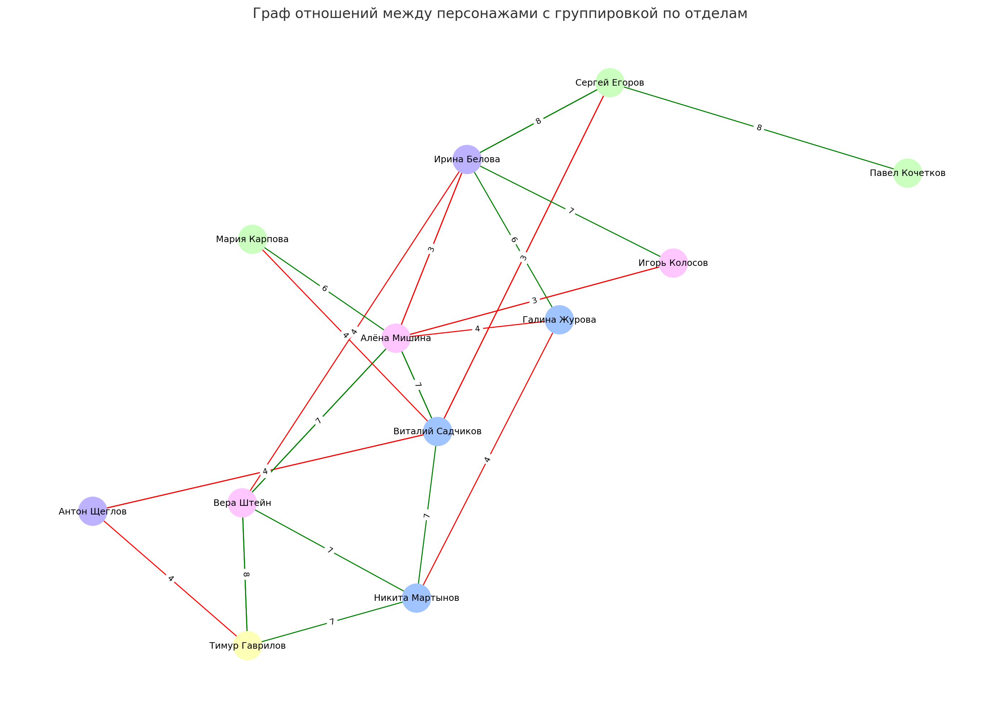

# 👥 Персонажи компании «СтальПрогресс»


| Отдел        | Имя                        | Должность                        | Возраст | Проф. комп. | IT-комп. | Отношение к игроку | Отношения с другими персонажами        | Характеристика                          |
|--------------|-----------------------------|----------------------------------|---------|-------------|----------|--------------------|----------------------------------------|-----------------------------------------|
| ИТ           | **Виталий Садчиков**        | Руководитель ИТ-отдела          | 41      | 8           | 9        | 5 (настороженно)   | Дружит с Алёной, спорит с Сергеем      | Жёсткий, всё контролирует сам           |
| ИТ           | **Никита Мартынов**         | Младший ИТ-специалист            | 26      | 5           | 7        | 6 (дружелюбно)     | Уважает Виталия, дружит с Верой        | Спокойный, склонен учиться              |
| ИТ           | **Галина Журова**           | Администратор 1С                 | 38      | 7           | 6        | 5                  | Сдержанна с Ириной и Алёной            | Исполнительная, но бюрократка           |
| Бухгалтерия  | **Ирина Белова**            | Главный бухгалтер                | 58      | 10          | 3        | 5 (формально)      | Доверяет Сергею, конфликтует с Алёной  | Властная, опирается на регламенты       |
| Бухгалтерия  | **Оксана Лысенко**          | Специалист по расчётам           | 33      | 6           | 5        | 5                  | Следует за Ириной                      | Тихая, но внимательная                  |
| Бухгалтерия  | **Антон Щеглов**            | Ведущий бухгалтер по тендерам    | 40      | 7           | 4        | 4 (подозрительно)  | Вспыльчив, часто спорит с ИТ          | Осторожен, проверяет каждую бумагу      |
| Кадры        | **Алёна Мишина**            | Руководитель отдела кадров       | 34      | 7           | 6        | 5 (нейтрально)     | Дружит с Виталием, критикует Ирину     | Модернистка, открыта к изменениям       |
| Кадры        | **Вера Штейн**              | Специалист по обучению           | 29      | 6           | 7        | 6 (позитивно)      | Хорошо ладит с Тимуром и Никитой       | Энтузиаст, поддерживает инициативы      |
| Кадры        | **Игорь Колосов**           | Делопроизводитель                | 46      | 5           | 3        | 5                  | Консервативен, сторонник Ирины         | Медлителен, требует точности            |
| Производство | **Сергей Егоров**           | Начальник цеха                   | 45      | 9           | 2        | 5 (прагматично)    | Доверяет Ирине, не любит айтишников    | Жёсткий, решает быстро                  |
| Производство | **Павел Кочетков**          | Мастер участка                   | 39      | 7           | 4        | 5 (спокойно)       | Поддерживает Сергея                    | Спокойный, ориентирован на результат    |
| Производство | **Мария Карпова**           | Инженер по охране труда          | 36      | 6           | 5        | 6 (нейтрально)     | Уважает Алёну, раздражает Виталия      | Говорит формально, любит регламенты     |
| ИБ           | **Тимур Гаврилов**          | Техник по ИБ (в подчинении)      | 24      | 5           | 7        | 6 (лояльно)        | Дружит с Верой, смотрит на игрока как на наставника | Молодой, инициативный, хочет развиваться |

## Отношения более детально заданы в npc-rel-matrix.csv

Вот визуализация с **группировкой по отделам**:



- 🎨 Цвет узла = принадлежность к отделу:
  - 🟦 **ИТ** — голубой  
  - 🟪 **Бухгалтерия** — сиреневый  
  - 🌸 **Кадры** — розовый  
  - 🟩 **Производство** — зелёный  
  - 🟨 **ИБ** — жёлтый

- 🔁 Стрелки и цифры остались как раньше — показывают направленное отношение и его силу.

## Code

```python
# Определим отделы для каждого персонажа
departments = {
    "Виталий Садчиков": "ИТ", "Никита Мартынов": "ИТ", "Галина Журова": "ИТ",
    "Ирина Белова": "Бухгалтерия", "Оксана Лысенко": "Бухгалтерия", "Антон Щеглов": "Бухгалтерия",
    "Алёна Мишина": "Кадры", "Вера Штейн": "Кадры", "Игорь Колосов": "Кадры",
    "Сергей Егоров": "Производство", "Павел Кочетков": "Производство", "Мария Карпова": "Производство",
    "Тимур Гаврилов": "ИБ"
}

# Цвета по отделам
department_colors = {
    "ИТ": "#a0c4ff",
    "Бухгалтерия": "#bdb2ff",
    "Кадры": "#ffc6ff",
    "Производство": "#caffbf",
    "ИБ": "#fdffb6"
}

# Сопоставим цвета узлам по отделу
node_colors = [department_colors[departments[node]] for node in G.nodes]

# Перерисуем граф с группировкой по отделам
plt.figure(figsize=(14, 10))
pos = nx.spring_layout(G, seed=42, k=0.8)
nx.draw_networkx_nodes(G, pos, node_color=node_colors, node_size=800)
nx.draw_networkx_edges(G, pos, edge_color=edge_colors, arrows=True)
nx.draw_networkx_labels(G, pos, font_size=9)

# Подписи с весами
edge_labels = nx.get_edge_attributes(G, 'weight')
nx.draw_networkx_edge_labels(G, pos, edge_labels=edge_labels, font_size=8)

# Заголовок и отключение осей
plt.title("Граф отношений между персонажами с группировкой по отделам", fontsize=14)
plt.axis('off')
plt.tight_layout()
plt.show()
```
