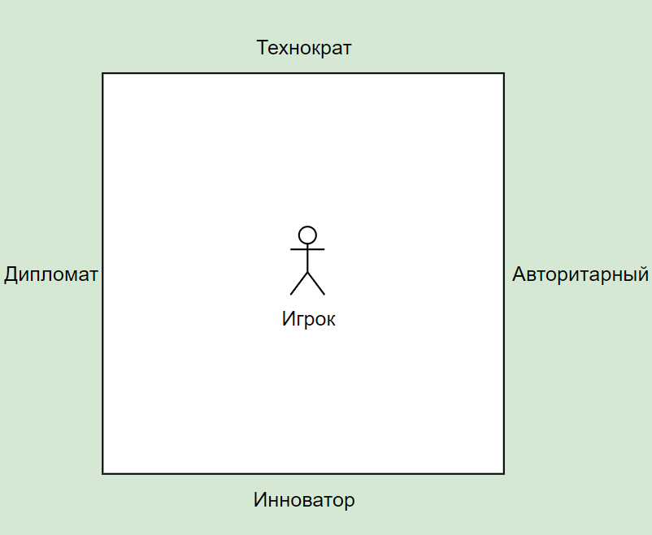

# 🧩 СИСТЕМА НАПРАВЛЕНИЯ ИГРОКА

## 🎯  Четыре стиля игрока:

| Стиль           | Суть                         | Краткое описание |
|:----------------|:------------------------------|:-----------------|
| **Дипломат**     | Умение договариваться         | Мягкий, гибкий, стратег |
| **Технократ**    | Рациональность, технологии    | Факты, цифры, эффективность |
| **Авторитарный** | Жёсткость, контроль            | Приказы, директивы |
| **Инноватор** (*"Зумер"*) | Идеи, креатив, неформальный подход | Инициатива, нетривиальные методы |

---

## 🧮 Формулы движения по квадрату

Для каждого выбора в диалоге присваивается направление:
- Дипломат = +1 по оси X (влево)
- Технократ = +1 по оси Y (вверх)
- Авторитарный = -1 по оси X (вправо)
- Инноватор = -1 по оси Y (вниз)

**Позиция игрока** рассчитывается так:
```text
X = Σ(баллы по горизонтали)  # Дипломатия ↔ Авторитаризм
Y = Σ(баллы по вертикали)    # Инновации ↔ Технократия
```

---
  
## 🛠️ Визуализация квадрата через 





**Иллюстрация осей:**
- Левый край — **Дипломат**  
- Правый край — **Авторитарный**  
- Верх — **Технократ**  
- Низ — **Инноватор**

---


## 🧭 СХЕМА ДВИЖЕНИЯ ПО Осям

| Тип реплики        | Описание поведения                                      | Изменение координат (ΔX, ΔY) |
|--------------------|----------------------------------------------------------|------------------------------|
| **Дипломат**       | Предлагает компромисс, ищет баланс, сглаживает углы     | `(+1, 0)`                    |
| **Технократ**      | Аргументирует фактами, опирается на технологии и логику | `(0, +1)`                    |
| **Авторитарный**   | Приказывает, жёстко управляет, не терпит возражений     | `(-1, 0)`                    |
| **Инноватор**      | Предлагает нестандартное, дерзит, использует неформат   | `(0, -1)`                    |

---

## 🧠 Расширение: Модификаторы веса

Чтобы управлять **влиянием**, можно вводить **весовые коэффициенты** — например:

| Тип ситуации                          | Модификатор к баллу |
|--------------------------------------|----------------------|
| Реплика в ключевой ситуации          | ×2                   |
| Повторный выбор одного стиля подряд  | ×0.5 (затухание)     |
| Новый стиль после другого            | ×1.2 (новизна)       |

Это позволит избегать простого «спама» одного стиля и **стимулирует разнообразие** поведения.

---

## 📊 Формула финального положения

```text
X = Σ(баллы за дипломатичность - баллы за авторитарность)
Y = Σ(баллы за технократичность - баллы за креативность)
```

То есть:
- `X > 0` — игрок дипломатичен  
- `X < 0` — игрок авторитарен  
- `Y > 0` — технарь  
- `Y < 0` — новатор  

---

## 💡 Примеры типов реплик (без сценариев)

| Категория       | Примеры намерений |
|-----------------|------------------|
| **Дипломат**    | "Давайте найдём решение, которое устроит всех"  
| **Технократ**   | "Данные показывают, что так будет эффективнее"  
| **Авторитарный**| "Сделайте это. Без обсуждений"  
| **Инноватор**   | "А если сделать наоборот, ради эксперимента?"

---

## 🧰 Готово к использованию в системе:

- Каждой реплике в базе присваивается:
  - Тег стиля (`diplomat`, `technocrat`, `authoritarian`, `innovator`)
  - Балл смещения (`+1`, `-1`, и т.д.)
- В диалоге сохраняется история движения игрока.
- Квадрат игрока формируется **на лету** и может быть показан в интерфейсе (как рекомендация, стиль управления и т.п.)

## 🔥 Как будет использоваться результат

| Позиция на квадрате | Рекомендация по работе |
|:--------------------|:------------------------|
| +Технократ +Авторитарный | Госорганы, крупные корпорации |
| +Дипломат +Инноватор | Стартапы, международные компании |
| +Авторитарный +Инноватор | Управление кризисами, спецпроекты |
| +Дипломат +Технократ | Консалтинг, стратегии |