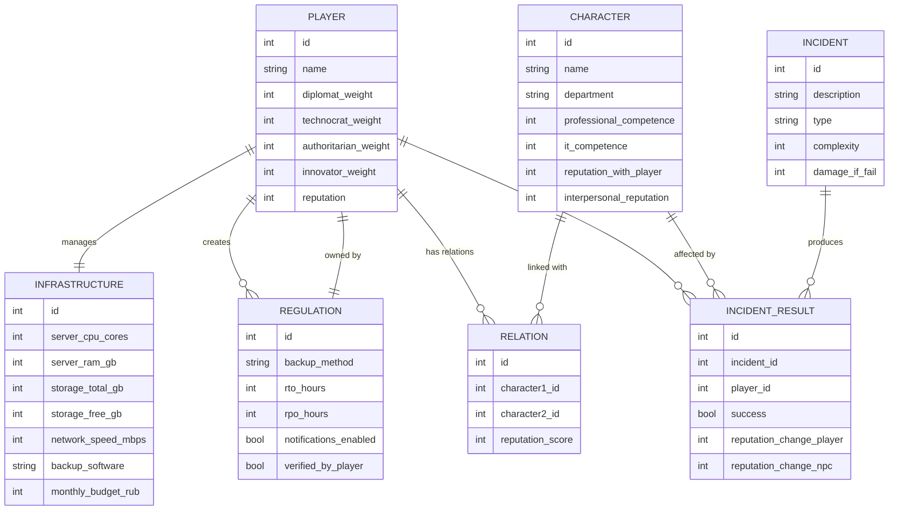

**Отдел:** Бухгалтерия  
**Персонаж:** Ирина Викторовна Белова (главный бухгалтер)

---

## 🧩 Этап 1: Вступление

*(Игрок приходит на встречу в кабинет Ирины Беловой.)*

**Ирина Белова:**  
> "Здравствуйте. Чем обязаны визиту?"

---

## 🧩 Этап 2: Вопрос о допустимом периоде простоя

**Игрок задаёт вопрос:**  
_"Какой допустимый период простоя для бухгалтерских систем, чтобы минимизировать ущерб?"_

| Стиль         | Реплика игрока | Изменение репутации | Вес на стиль | Реакция Ирины Беловой |
|---------------|----------------|---------------------|--------------|-----------------------|
| **Дипломат** | "Понимаю, насколько важна стабильность работы. Подскажите, какой перерыв будет приемлемым для бухгалтерии?" | +1 | +1 дипломат | (доверительно) "Больше двух часов — уже серьёзные проблемы с платёжными сроками." |
| **Технократ** | "Нужно зафиксировать реальный RTO в регламент. Назовите допустимое время простоя, в часах." | +0 | +1 технократ | (делово) "До двух часов максимум. Записывайте." |
| **Авторитарный** | "Назовите конкретное время простоя. Без деталей." | -2 | +1 авторитарный | (раздражённо) "Мы не в казарме. Но раз уж надо — максимум два часа." |
| **Инноватор** | "А если внедрить мобильные копии для срочных платежей? Снизит зависимость от основного сервера." | +0 | +1 инноватор | (с сомнением) "Хм... Интересно, но нужно сначала оценить риски." |

🔹 **Дополнительная реплика Ирины при дипломатичном/технократичном подходе:**  
> "Имейте в виду, ежедневные копии могут быть недостаточными. Лучше каждые 2-3 часа делать бэкап."

---

## 🧩 Этап 3: Вопрос о критичных данных

**Игрок задаёт вопрос:**  
_"Какие данные для бухгалтерии критичны и должны быть обязательно защищены?"_

| Стиль         | Реплика игрока | Изменение репутации | Вес на стиль | Реакция Ирины Беловой |
|---------------|----------------|---------------------|--------------|-----------------------|
| **Дипломат** | "Хотел бы учитывать ваши реальные приоритеты. Что нужно сохранить в первую очередь?" | +1 | +1 дипломат | (спокойно) "Базы 1С, налоговая отчётность, реестры расчётов, договоры." |
| **Технократ** | "Прошу перечислить базы, архивы, документы, требующие резервного копирования." | +0 | +1 технократ | (делово) "Я передам список IT — базы, отчётность, расчётные ведомости." |
| **Авторитарный** | "Дайте список данных, которые будут восстановлены первыми." | -2 | +1 авторитарный | (раздражённо) "Вы здесь, чтобы помогать, а не командовать. Вот список — и без криков." |
| **Инноватор** | "Может, стоит включить автосохранение расчётов в режиме реального времени?" | +0 | +1 инноватор | (в раздумьях) "Если это надёжно, тогда да, стоит подумать." |

🔹 **Дополнительная реплика Ирины при нормальной атмосфере:**  
> "Налоговая требует хранить документы минимум 5 лет. Архив — это наше всё."

---

## 🧩 Этап 4: Вопрос о последствиях утраты данных

**Игрок задаёт вопрос:**  
_"Какие последствия могут возникнуть при утрате этих данных?"_

| Стиль         | Реплика игрока | Изменение репутации | Вес на стиль | Реакция Ирины Беловой |
|---------------|----------------|---------------------|--------------|-----------------------|
| **Дипломат** | "Хочу максимально понимать риски, чтобы надёжно защитить ваши интересы." | +1 | +1 дипломат | (с доверием) "Без баз — ни зарплат, ни налогов. Штрафы и блокировка счетов." |
| **Технократ** | "Укажите возможные правовые последствия: статьи, штрафы." | +0 | +1 технократ | (делово) "КоАП РФ, статья 15.11. Плюс Постановление №1119 по защите информации." |
| **Авторитарный** | "Чётко: потери и штрафы. Быстрее." | -2 | +1 авторитарный | (холодно) "Грубо, но по делу. Готовьте план защиты базы 1С." |
| **Инноватор** | "Есть ли нестандартные пути быстрой компенсации утраченных данных?" | +0 | +1 инноватор | (осторожно) "Возможно, через операторов ЭДО, но надёжнее иметь резерв здесь." |

🔹 **Дополнительная реплика Ирины в процессе нормальной беседы:**  
> "Проверяйте резервные копии хотя бы раз в месяц. Повреждённый архив — это тоже потеря."

---

## 📚 Нормативная база, на которую ссылается Ирина:

- **КоАП РФ, Статья 15.11:** Грубое нарушение правил бухгалтерского учета (штрафы до 30 000 ₽).
- **Федеральный закон №152-ФЗ:** "О персональных данных".
- **Постановление Правительства РФ №1119 от 01.11.2012:** Требования к защите информации.

---


---

# 📋 Дополнительные реплики Ирины Беловой для игры

---

## Эти реплики могут:

- Раскрывать **особенности бизнес-процессов**,
- Подсказывать **дополнительные риски**,
- Требовать от игрока **реагировать умнее**,
- Добавлять **атмосферу реального разговора**.


## 🟦 Реплики-подсказки (при нормальном/позитивном общении)

- 💬 "Учтите, что без локального архива налоговой отчётности нас просто заблокируют при первой же проверке."
- 💬 "Я бы на вашем месте заложила двойное резервирование: одна копия у нас, вторая — на внешнем носителе."
- 💬 "Бухгалтерские реестры надо хранить как минимум 5 лет, а некоторые документы — вообще бессрочно."
- 💬 "Клиентские счета и контракты — тоже чувствительная зона. Их утечка = нарушение ФЗ №152."
- 💬 "У операторов ЭДО есть свои копии, но в суде они не всегда принимаются без локального дубликата."

---

## 🟥 Реплики-предупреждения (если игрок грубый или слишком технарь)

- 💬 "Если сделаете бэкап так, что я потом три дня буду восстанавливать базы — спасибо вам не скажу."
- 💬 "Не забывайте про человеческий фактор. Самые частые потери — не из-за атак, а из-за ошибок сотрудников."
- 💬 "Потерянный архив = незакрытый налоговый период = огромные штрафы. Хотите, чтобы нам заблокировали расчётные счета?"
- 💬 "Не всех наших сотрудников можно пустить к резервным копиям. Нужно разграничение прав."

---

## 🟩 Реплики-идеи (если игрок креативит или ведёт диалог в стиле инноваций)

- 💬 "А если бы была система автоотчётов по успешности копирования... Это было бы здорово. Видно сразу: всё сохранено или нет."
- 💬 "Если бы была копия, доступная только руководству, а не ИТ — это повысило бы уверенность в защите данных."
- 💬 "Можно ли сделать так, чтобы старые копии автоматически стирались через 5 лет? Иначе места уже не хватает."

---


(Когда игрок выбрал грубую реплику или раздражил персонажа.)

---

## 🟥 Скрытые угрозы, которые может сказать раздражённая Ирина Белова:

- 💬 "Потеря налоговой базы — это не просто сбой. Это доначисления налогов, штрафы и заморозка счетов."
- 💬 "ФНС не будет разбираться, кто виноват. Просто начислят штрафы и заблокируют деньги на расчетных счетах."
- 💬 "А если вы что-то сделаете неправильно — директор будет спрашивать в первую очередь с нас... и с вас."
- 💬 "Без отчётных документов нам закроют доступ в банк-клиент. Вы понимаете, что это значит для зарплат сотрудникам?"
- 💬 "Ошибочный бэкап — это скрытая бомба. Всё будет хорошо до первой внеплановой проверки."
- 💬 "Запомните: потеря хотя бы одного налогового регистра = судебные тяжбы на годы."

---

## 📚 Какие нормативные документы она могла бы упомянуть в раздражении:

- **Налоговый кодекс РФ, ст. 120:** Нарушение правил учёта — штраф до 30 000 ₽ + доначисления налогов.
- **КоАП РФ, Статья 15.11:** Нарушение бухучета — отдельный штраф.
- **Письма ФНС России:** о порядке хранения первичных документов (3–5 лет минимум).

---


## 📌 Куда эти реплики можно вставлять в игру:

- Автоматически после позитивной реакции на нормальный вопрос.
- После удачного выбора стиля игрока (дипломат, технократ, инноватор).
- Или как **дополнительную награду**: например, если игрок грамотно ведёт беседу и не раздражает персонажа.


---

# 📋 Полное описание: Выбор метода резервного копирования для бухгалтерии


## 🧩 Начальная инфраструктура (актуализированная)

- Сервер:  
  - **8 ядер CPU**, **32 ГБ RAM**
  - HDD SATA 4 ТБ (RAID 1)
- Сеть: 1 Гбит/с Ethernet
- Операционная система: Windows Server Standard
- Программное обеспечение: Старая система резервного копирования средствами Windows Backup
- Мониторинг резервного копирования отсутствует
- Средний размер активной базы данных 1С + документы: ~250 ГБ

---

## 📋 Методы резервного копирования: Влияние + Требования + Бюджет

---

### 📦 Полный бэкап

**Как влияет:**
- Требуется большое пространство под каждую копию
- Высокая нагрузка на сервер во время ночных копирований

**Что нужно увеличить:**
- Диски: добавить ещё 4 ТБ для хранения копий
- ПО: Windows Backup недостаточно → нужно стороннее ПО типа Acronis

**Бюджет:**
- RAID расширение (SSD+HDD): ≈ 100 000 ₽
- Лицензия Acronis Standard: ≈ 60 000 ₽

**Итого:** **160 000 ₽**

---

### 📦 Инкрементальный бэкап

**Как влияет:**
- Низкая нагрузка при копировании
- Риск при повреждении инкрементов

**Что нужно увеличить:**
- Стабильное хранилище
- Мониторинг целостности цепочек

**Бюджет:**
- ПО для умного управления цепочками (Nakivo Essentials): ≈ 40 000 ₽
- Дисковое пространство (дополнительно 2 ТБ SSD): ≈ 70 000 ₽

**Итого:** **110 000 ₽**

---

### 📦 Дифференциальный бэкап

**Как влияет:**
- Средняя нагрузка
- Растущие размеры дифференциальных бэкапов

**Что нужно увеличить:**
- Место под растущие дифференциалы

**Бюджет:**
- Дисковое расширение HDD на 4 ТБ: ≈ 50 000 ₽
- Базовое ПО резервного копирования (например, Veeam Community Edition — бесплатно)

**Итого:** **50 000 ₽**

---

### 📦 Зеркальный бэкап

**Как влияет:**
- Мгновенная потеря данных при ошибке

**Что нужно увеличить:**
- SSD RAID массив под живую синхронизацию
- Запасная копия на другом устройстве

**Бюджет:**
- SSD RAID (RAID10 на 4×2 ТБ SSD): ≈ 240 000 ₽
- Сервер или NAS для копии зеркала: ≈ 120 000 ₽

**Итого:** **360 000 ₽**

---

### 📦 Реверсивный инкрементальный бэкап

**Как влияет:**
- Постоянная обработка данных
- Быстрое восстановление

**Что нужно увеличить:**
- Быстрый процессор
- RAID10 на SSD

**Бюджет:**
- Апгрейд сервера (CPU до 16 ядер, RAM до 64 ГБ): ≈ 150 000 ₽
- RAID10 SSD (4×2 ТБ SSD): ≈ 240 000 ₽
- ПО резервного копирования Veeam Essentials: ≈ 120 000 ₽

**Итого:** **510 000 ₽**

---

### 📦 Смарт-бэкап

**Как влияет:**
- Гибкая настройка без сильной нагрузки

**Что нужно увеличить:**
- Лицензионное ПО с возможностью построения смарт-сценариев

**Бюджет:**
- ПО типа Acronis Advanced Backup или Nakivo Enterprise: ≈ 90 000 ₽
- Немного дополнительного места (2 ТБ HDD): ≈ 40 000 ₽

**Итого:** **130 000 ₽**

---

### 📦 Непрерывная защита данных (CDP)

**Как влияет:**
- Перегруз по сети и серверу

**Что нужно увеличить:**
- Отдельный сервер только для хранения CDP
- 10 Гбит/с сеть
- Многое хранилище на SSD

**Бюджет:**
- Новый сервер CDP (16 ядер, 128 ГБ RAM, RAID10 SSD): ≈ 800 000 ₽
- 10Гбит коммутаторы + сетевое оборудование: ≈ 300 000 ₽

**Итого:** **1 100 000 ₽**

---

### 📦 Синтетический полный бэкап

**Как влияет:**
- Ночью сборка полной копии
- Средняя нагрузка на диск и сеть

**Что нужно увеличить:**
- Автоматизация сборки

**Бюджет:**
- ПО резервного копирования с синтетическим бэкапом (Veeam Standard): ≈ 100 000 ₽
- Дисковое пространство для синтетических полных копий (2 ТБ SSD): ≈ 120 000 ₽

**Итого:** **220 000 ₽**

---

### 📦 Бесконечно-инкрементальный бэкап

**Как влияет:**
- Очень экономно по месту
- Сложная организация восстановления

**Что нужно увеличить:**
- Управление цепочкой

**Бюджет:**
- Специализированное ПО (Commvault, Rubrik): ≈ 300 000 ₽
- Обслуживание/администрирование

**Итого:** **300 000 ₽**

---

# 📋 Таблица итогового сравнения

| Метод                        | Требования к серверам | Диски      | ПО              | Бюджет ₽ |
|-------------------------------|------------------------|------------|-----------------|----------|
| Полный                       | Место                  | HDD +      | Acronis         | 160 000  |
| Инкрементальный              | Умеренные              | SSD +      | Nakivo          | 110 000  |
| Дифференциальный             | Лёгкие                 | HDD        | Базовое         | 50 000   |
| Зеркальный                   | Высокие                | RAID SSD   | Стандартное     | 360 000  |
| Реверсивный инкрементальный   | Очень высокие          | RAID SSD   | Veeam Essentials| 510 000  |
| Смарт-бэкап                  | Средние                | HDD +      | Acronis Advanced| 130 000  |
| CDP                          | Очень высокие           | RAID SSD   | Спец. системы   | 1 100 000|
| Синтетический полный         | Средние                | SSD        | Veeam Standard  | 220 000  |
| Бесконечно-инкрементальный    | Высокие                | HDD/SSD    | Commvault       | 300 000  |

---

# 📋 ИТОГО: Логичный выбор для бухгалтерии

- 🏆 **Оптимальный выбор:**  
  - **Реверсивный инкрементальный бэкап** + **Синтетический полный бэкап**

- 💬 **Почему:**  
  - Быстрое восстановление
  - Минимизация потерь данных
  - Сбалансированная нагрузка на серверы
  - Чёткая защита от юридических рисков

- 💸 **Оценка бюджета:**  
  **~510 000 ₽** на модернизацию серверной инфраструктуры и ПО.

---
# Составление регламента 

https://github.com/GoldenPsycho/i/scenarios/Backup/Buh_backup/Buh_backup.md
---


# 📋 Полный сценарий согласования регламента резервного копирования с ИТ по ВСЕМ методам

https://github.com/GoldenPsycho/i/scenarios/Backup/IT_backup_reaction.md

---
Если руководство дало согласие 
---

# Механика Закупок

https://github.com/GoldenPsycho/i/mechanics/money/mony.md

---


---

# 📋 Этап 3: Реализация регламента резервного копирования через техника

---

## 📌 Персонаж:  
**Техник отдела ИБ** —  
имя: **Андрей Бойко**, 20 лет, начинающий ИБ-специалист.

**Описание:**  
Компетентный, но иногда недопонимает тонкости процедур. Может недонастроить сложные вещи без контроля.

---

## 📌 1. Начальный диалог: Поручение на реализацию регламента

| Стиль игрока   | Реплика | Изменение репутации | Вес на стиль | Реакция Андрея |
|----------------|---------|---------------------|--------------|----------------|
| **Дипломат**   | "Андрей, твоя помощь очень важна. Нужно корректно внедрить регламент резервного копирования." | +1 | +1 Дипломат | (спокойно) "Конечно, всё сделаю в лучшем виде." |
| **Технократ**  | "Прошу строго следовать техническим параметрам регламента. Никаких отклонений." | 0 | +1 Технократ | (серьёзно) "Принято. Всё по инструкции." |
| **Авторитарный** | "Есть приказ: настроить резервирование по регламенту. Без самодеятельности." | -2 | +1 Авторитарный | (напряжённо) "Как скажете..." |
| **Инноватор**  | "Если увидишь возможность дополнительно оптимизировать — аккуратно предложи." | 0 | +1 Инноватор | (одобрительно) "Окей, посмотрю варианты." |

---

## 📌 2. Дополнительная необязательная реплика

Игрок может дополнительно сказать:

💬 "И ещё, пожалуйста, настрой отправку отчётов о статусе резервного копирования мне на почту."

- Если игрок не скажет — отправка отчётов настроена не будет.
- Это сильно повлияет на обнаружение ошибок в будущем инциденте.

---

## 📌 3. Андрей реализует настройку

**Зависимость качества настройки:**
- Если отношение хорошее и инструкции были понятные — шанс корректной настройки 90%.
- Если плохое отношение или сложная методика (например, бесконечно-инкрементальный бэкап) — шанс ошибки увеличивается.

**Ошибки могут быть:**
- Неверная частота бэкапов
- Не включены отчёты
- Пропущена критичная база данных

---

## 📌 4. Андрей сообщает:

💬 "Я всё настроил. Всё готово к работе!"

---

## 📌 5. Выбор игрока:

| Действие        | Последствия |
|-----------------|-------------|
| Проверить работу | Включается дополнительный диалог, возможность обнаружить ошибки |
| Довериться технику | Оставить всё как есть, риск пропустить ошибки |

---

## 📌 6. Проверка работы: новый диалог

**Игрок просит Андрея предоставить подтверждение:**

| Стиль игрока   | Реплика | Изменение репутации | Вес на стиль | Реакция Андрея |
|----------------|---------|---------------------|--------------|----------------|
| **Дипломат**   | "Андрей, можешь прислать конфигурацию настроек для проверки? Нужно для отчётности." | +1 | +1 Дипломат | "Конечно, сейчас всё отправлю." |
| **Технократ**  | "Прошу выслать конфигурационные файлы резервного копирования для сверки с регламентом." | 0 | +1 Технократ | "Без проблем, отправлю на почту." |
| **Авторитарный** | "Прислать полные настройки сейчас. Немедленно." | -2 | +1 Авторитарный | (недовольство) "Хорошо, отправлю..." |
| **Инноватор**  | "Может быть, заодно предложишь, что ещё можно улучшить в текущей настройке?" | 0 | +1 Инноватор | "О, интересная идея. Подумаю, что можно добавить." |

---

## 📌 7. Что присылает Андрей


## 📋 Конкретные примеры данных от техника по каждой методике

---

### 📦 Полный бэкап

> **Файл:**  
> `backup_schedule_full.txt`
> 
> **Содержимое:**  
> ```
> Тип: Полный бэкап
> Данные: 1С_Бухгалтерия, Налоговая_отчётность, Архив_расчётов
> Периодичность: Ежедневно в 02:00
> Хранилище: Сервер-Бэкап01
> Уведомления: Отключены
> ```

---

### 📦 Инкрементальный бэкап

> **Файл:**  
> `incremental_plan.json`
> 
> **Содержимое:**  
> ```json
> {
>   "BaseBackup": "Понедельник 02:00",
>   "Increments": [
>     "Вторник 02:00",
>     "Среда 02:00",
>     "Четверг 02:00",
>     "Пятница 02:00"
>   ],
>   "CheckedIntegrity": false
> }
> ```

---

### 📦 Дифференциальный бэкап

> **Файл:**  
> `diff_backup_report.csv`
> 
> **Содержимое:**  
> ```
> Дата полного бэкапа: Понедельник
> Дифференциалы:
> Вторник: OK
> Среда: OK
> Четверг: OK
> Пятница: OK
> Хранилище: Бэкап02
> ```

---

### 📦 Зеркальный бэкап

> **Файл:**  
> `mirror_config.txt`
> 
> **Содержимое:**  
> ```
> Тип резервирования: Зеркалирование
> Источник: Основной сервер бухгалтерии
> Приёмник: Зеркальный сервер 192.168.1.20
> Метод копирования: Прямая синхронизация без версий
> Уведомления: Нет
> ```

---

### 📦 Реверсивный инкрементальный бэкап

> **Файл:**  
> `reverse_inc_config.yaml`
> 
> **Содержимое:**  
> ```yaml
> BaseBackup: Еженедельно в воскресенье 03:00
> ReverseIncrements:
>   - Понедельник 06:00
>   - Понедельник 12:00
>   - Понедельник 18:00
> Проверка целостности: Да
> Хранилище: SSD_RAID_Backup
> ```

---

### 📦 Смарт-бэкап

> **Файл:**  
> `smart_backup_script.sh`
> 
> **Содержимое:**  
> ```bash
> # Полный бэкап
> 0 2 * * 0 full_backup.sh
> # Инкременты
> 0 2 * * 1-6 incremental_backup.sh
> # Проверка места на диске
> 0 3 * * * check_space.sh
> ```

> **Описание:**  
> ```
> Стратегия: Полный раз в неделю + инкременты ежедневно
> Автоматизация отчётов: Включена
> ```

---

### 📦 CDP (Continuous Data Protection)

> **Файл:**  
> `cdp_activity_log.txt`
> 
> **Содержимое:**  
> ```
> 00:01:32 База 1С изменена → изменения зафиксированы
> 00:01:40 Файл Отчёт_по_налогам.xlsx изменён → изменения зафиксированы
> 00:02:00 Новый файл Контракт_2025.docx создан → изменения зафиксированы
> ...
> ```

---

### 📦 Синтетический полный бэкап

> **Файл:**  
> `synthetic_full_assembly.log`
> 
> **Содержимое:**  
> ```
> 01:55 Начало сборки полной синтетической копии
> 02:20 Объединение данных из полного бэкапа + инкрементов
> 02:40 Синтетический бэкап успешно завершён
> Хранилище: Backup_Syn01
> ```

---

### 📦 Бесконечно-инкрементальный бэкап

> **Файл:**  
> `forever_increment_list.txt`
> 
> **Содержимое:**  
> ```
> Полный бэкап создан: 01.05.2025
> Инкременты:
> 02.05.2025 - 1С база изменена
> 03.05.2025 - Новый отчёт добавлен
> 04.05.2025 - Изменения в архивных реестрах
> 05.05.2025 - Обновление зарплатных ведомостей
> ...
> Автоматическая проверка целостности цепочки: Включена
> ```


---

## 📌 8. Сравнение с регламентом

**Игрок должен сам сравнить:**

- Частоту бэкапов
- Список данных
- Наличие отчётов о статусе
- Методика соответствует заявленной в регламенте?

**Если не соответствует:**
- Игрок может инициировать дополнительное исправление (потребует ещё одно общение с техником).

---

# 📋 Диалог с техником при обнаружении ошибок

---

## 📌 Игрок инициирует повторное общение

**Фраза:**  
_"Андрей, при проверке настроек резервного копирования были найдены несоответствия регламенту."_

---

## 📌 4 варианта реплик игрока

| Стиль игрока   | Реплика | Изменение репутации | Вес на стиль | Реакция Андрея |
|----------------|---------|---------------------|--------------|----------------|
| **Дипломат**   | "Понимаю, что настройка сложная. Давайте вместе исправим и доведём всё до нужного уровня." | +1 | +1 Дипломат | (спокойно) "Конечно. Сейчас исправлю, спасибо что проверили." |
| **Технократ**  | "Выявлены отклонения от технического регламента. Прошу внести корректировки." | 0 | +1 Технократ | (делово) "Принято. Исправлю всё по требованиям." |
| **Авторитарный** | "Ошибки недопустимы. Немедленно исправить и доложить об исправлении." | -2 | +1 Авторитарный | (напряжённо) "Ладно... Исправлю." |
| **Инноватор**  | "Есть возможность оптимизировать процесс при исправлении. Можем заодно улучшить резервирование?" | 0 | +1 Инноватор | (с энтузиазмом) "Круто! Есть пара идей, что можно сделать лучше." |

---

## 📌 Что происходит после реплики

- **Если игрок выбрал дипломатичный или нормальный подход** → техник с энтузиазмом исправляет ошибку.
- **Если игрок грубо давит** → техник исправляет, но с недовольством (и возможными новыми ошибками).

---

## 📌 Андрей сообщает:

**Фраза после исправления:**  
> "Я всё перепроверил, внёс исправления. Отправляю вам новый отчёт для проверки."

---

## 📌 Новый файл от техника

Андрей снова присылает файл, который должен теперь **строго соответствовать регламенту**.

**Если игрок повторно проверит:**
- Если всё верно → процесс завершён успешно ✅
- Если всё ещё есть ошибки (при плохих отношениях или сложной методике) → будет дополнительный риск при инциденте 🔥

---

# 📋 Пример — как это будет видно игроку:

---

**Игрок выбрал (Дипломат):**  
_"Понимаю, что настройка сложная. Давайте вместе исправим и доведём всё до нужного уровня."_

**Андрей:**  
_"Конечно! Спасибо за доверие. Сейчас всё поправлю."_

(Репутация +1, Дипломатия +1)

Через некоторое время...

**Файл:** `reverse_inc_config.yaml` (обновлённый)  
**Содержимое:**
```yaml
BaseBackup: Еженедельно в воскресенье 03:00
ReverseIncrements:
  - Понедельник 06:00
  - Понедельник 12:00
  - Понедельник 18:00
Проверка целостности: Да
Уведомления: Включены (Отправка отчётов на email руководителя ИБ)
Хранилище: SSD_RAID_Backup
```

✅ Всё совпадает с регламентом!

---

# 📋 Краткая структура действий

| Шаг | Что делает игрок | Результат |
|-----|------------------|-----------|
| 1   | Обнаруживает ошибку | Даёт команду на исправление |
| 2   | Выбирает стиль общения | Меняет репутацию/вес |
| 3   | Андрей исправляет | Отправляет новые данные |
| 4   | Игрок проверяет | Либо всё ок, либо остаются риски |

---


# 📋 Ошибки техника при настройке резервного копирования

(в зависимости от выбранной методики)

---

## 📦 Полный бэкап

**Возможные ошибки:**
- Бэкап настроен только на рабочую базу 1С, без архивов и расчётов.
- Не настроено уведомление об ошибке резервирования.

**Последствия на инциденте:**
- При восстановлении части архивных данных просто нет.
- Игроку придется объяснять потерю данных.

---

## 📦 Инкрементальный бэкап

**Ошибки:**
- Отсутствует проверка целостности инкрементальных цепочек.
- Пропущены важные документы в заданиях копирования.

**Последствия:**
- При попытке восстановления база разваливается из-за отсутствия одного инкремента.
- Игрок получает минус к репутации в глазах руководства.

---

## 📦 Дифференциальный бэкап

**Ошибки:**
- Неверная периодичность создания дифференциалов (раз в два дня вместо ежедневного).

**Последствия:**
- В случае восстановления — потеря последних 2–3 дней работы.

---

## 📦 Зеркальный бэкап

**Ошибки:**
- Настроено прямое зеркало без контроля целостности.
- Никаких теневых копий нет.

**Последствия:**
- В случае заражения вирусом оба зеркала шифруются одновременно.
- Потеря всех данных бухгалтерии.

---

## 📦 Реверсивный инкрементальный бэкап

**Ошибки:**
- Неправильное обновление полной копии — сохраняются только инкременты.
- Уведомления об ошибках отключены.

**Последствия:**
- Восстановить данные можно только за неделю назад.
- Бухгалтерия простаивает несколько дней → штраф от налоговой.

---

## 📦 Смарт-бэкап

**Ошибки:**
- Сценарий резервирования настроен без проверки места на диске.
- Задвоение инкрементальных и полных бэкапов.

**Последствия:**
- Переполнение диска → автоматическое прерывание резервирования.
- Последние копии недоступны при инциденте.

---

## 📦 CDP (Continuous Data Protection)

**Ошибки:**
- Неверно настроена частота фиксации изменений.
- Слабое шифрование логов.

**Последствия:**
- При атаке злоумышленники получают доступ ко всем зафиксированным изменениям.
- Нарушение закона о защите персональных данных.

---

## 📦 Синтетический полный бэкап

**Ошибки:**
- Неверная настройка времени сборки (например, днём вместо ночи).
- Синтетика собирается, но не тестируется.

**Последствия:**
- Во время рабочего дня сервер падает от перегрузки.
- Нарушение SLA по доступности данных.

---

## 📦 Бесконечно-инкрементальный бэкап

**Ошибки:**
- Слишком длинная цепочка инкрементов без контрольных точек.
- Нет механизма исправления битых инкрементов.

**Последствия:**
- В случае сбоя одного файла вся история резервирования становится бесполезной.

---

# 📋 Как это связано с проверкой игрока

| Проверил настройки | Результат |
|--------------------|-----------|
| Да | Обнаружил ошибки заранее, исправил → меньше рисков на инциденте |
| Нет | Ошибки остались → инцидент будет серьёзнее, репутация упадёт |

---

# 📋 Пример короткой логики на этапе инцидента

- Инцидент: сбой на сервере бухгалтерии.
- Игра проверяет:
  - Какая методика бэкапа выбрана,
  - Были ли ошибки в настройках,
  - Настроены ли уведомления об ошибках,
  - Проверял ли игрок результат работы техника.

**И в зависимости от этого:**
- Либо быстрое восстановление (успех)
- Либо долгий простой, штрафы, падение репутации (провал)

---


# 📋 Сценарии инцидентов для Бухгалтерии

---

## 📦 Инцидент 1: Сбой на сервере хранения данных

**Описание:**
- Утром бухгалтерия сообщает: "Не можем подключиться к базе 1С".
- Игрок вызывается для срочной ликвидации.

**Ход событий:**

1. Игрок приходит на место.
2. Видит: Сервер хранения недоступен, локальные файлы повреждены.

**Реакция игрока:**
- Проверить регламент: какой метод резервирования был настроен?
- Инициировать восстановление из последней актуальной резервной копии.

**Развитие:**

| Условие | Последствия |
|---------|-------------|
| Всё настроено правильно (реверсивный инкрементальный или синтетический полный) | Восстановление за 1–2 часа, минимальные потери |
| Неправильная методика или косяк техника | Восстановление затягивается, потеря данных за несколько дней |

**Репутация:**

| Исход | Изменение репутации |
|-------|---------------------|
| Успех | +2 ко всем отношениям (ИТ, бухгалтерия, руководство) |
| Частичный успех | +1 к отношениям (ИТ), 0 к бухгалтерии |
| Провал | -3 к отношениям с бухгалтерией и ИТ |

**Дополнительные последствия:**
- При провале — на главбуха Ирина Белова тоже накладывается **-2** к её личной репутации в коллективе (не справилась с документооборотом).

---

## 📦 Инцидент 2: Атака вируса-шифровальщика

**Описание:**
- Приходит срочное сообщение от ИТ: "На рабочих станциях бухгалтерии замечены зашифрованные файлы!"

**Ход событий:**

1. Игрок идёт в отдел.
2. Проверяет: заражены ли только рабочие станции или затронуты серверные данные.

**Реакция игрока:**
- Проверяет доступность чистых резервных копий.
- Инициирует восстановление незаражённых данных из последнего бэкапа.

**Развитие:**

| Условие | Последствия |
|---------|-------------|
| Были настроены уведомления, своевременные бэкапы | Восстановление до заражения, потери минимальны |
| Не было уведомлений, бэкапы старые или повреждены | Потери данных 3–5 дней работы |

**Репутация:**

| Исход | Изменение репутации |
|-------|---------------------|
| Успех | +2 ко всем отношениям |
| Частичный успех | 0 к отношениям |
| Провал | -3 к бухгалтерии, -1 к руководству |

**Дополнительные последствия:**
- При провале бухгалтерия нарушает сроки сдачи отчётности в ФНС → штраф.
- Ирина Белова получает **-3 к личной репутации** в коллективе.

---

## 📦 Инцидент 3: Сбой из-за переполнения хранилища

**Описание:**
- Ночью система резервирования падает из-за нехватки места на диске.
- Утром обнаружено отсутствие новых копий за последние сутки.

**Ход событий:**

1. Игрок получает письмо от мониторинга или от бухгалтера.
2. Проверяет: почему нет новых резервных копий.

**Реакция игрока:**
- Срочно освобождает место или добавляет новое хранилище.
- Пробует провести бэкап вручную.

**Развитие:**

| Условие | Последствия |
|---------|-------------|
| Смарт-бэкап или правильно настроенные уведомления | Игрок узнаёт о переполнении заранее, предотвращает сбой |
| Неправильная настройка или нет уведомлений | Переполнение → потеря копий за 1–2 дня |

**Репутация:**

| Исход | Изменение репутации |
|-------|---------------------|
| Успех | +1 к отношениям с ИТ и бухгалтерией |
| Частичный успех | 0 |
| Провал | -2 к отношениям с бухгалтерией |

**Дополнительные последствия:**
- У бухгалтера Виктории Орловой (ведущий бухгалтер) тоже падает репутация **-2**, так как часть её данных утеряна.

---

# 📋 Диалоги после успешной ликвидации инцидента

**Если всё хорошо:**

- **Руководитель ИТ Виталий Садчиков:**  
  > "Отличная работа. Чётко и быстро. Приятно работать с профи."

- **Ирина Белова:**  
  > "Благодарю! Вы нас буквально спасли. Мы всё успели сдать вовремя."

- **Генеральный директор (письмо на почту игроку):**  
  > "Отлично справились. Именно так я представлял себе работу отдела ИБ. Так держать!"

- **Техник Андрей Бойко:**  
  > "Рад, что всё настроили правильно. Буду внимательнее в следующих проектах."

---

# 📋 Диалоги после провала

**Если провал:**

- **Ирина Белова:**  
  > "Из-за этой ситуации мы не сдали отчёт вовремя. Руководство недовольно…"

- **Виталий Садчиков:**  
  > "Я предупреждал, что нужна была проверка. Теперь расхлёбываем."

- **Генеральный директор (письмо на почту игроку):**  
  > "Не ожидал от вас такого. Примите меры, чтобы подобное больше не повторялось."

- **Техник Андрей Бойко:**  
  > "Может быть, стоило всё перепроверить основательнее…"

---

# 📋 Репутационные весы

| Действие          | Репутация игрока | Репутация бухгалтера/персонажей |
|-------------------|------------------|-------------------------------|
| Успех             | +2 или +1         | Без изменений                 |
| Частичный успех   | 0                 | -1 (редко)                    |
| Провал            | -2 / -3           | -2 / -3 персонажам в бухгалтерии |

---


# 📋  ER-диаграмма (Mermaid) 




---

# 📋 Кратко —  модель покрывает:

| Сущность | Что хранит |
|----------|------------|
| PLAYER | Игрока: стили, репутацию |
| CHARACTER | Персонажей: компетенции, отношения |
| REGULATION | Регламент резервирования |
| INFRASTRUCTURE | Метрики технической инфраструктуры |
| INCIDENT | Инциденты в игре |
| INCIDENT_RESULT | Результаты инцидентов и их влияние |
| RELATION | Взаимоотношения между персонажами |

---
