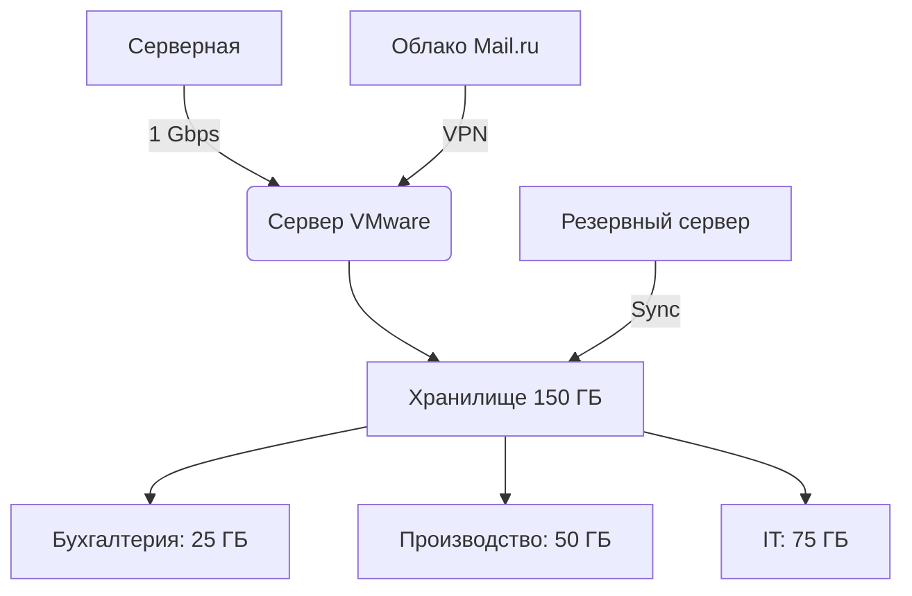

### **💬 Полный диалог с бухгалтером Валентиной Петровной **

**📍 Сцена:** Кабинет бухгалтерии. Валентина Петровна разбирает кипу документов, хмуро поглядывая на монитор с 1С.

---

#### **🔹 1. Начало разговора (3+ реплики)**
**Игрок:**  
*"Добрый день, Валентина Петровна! Мне необходимо обсудить с вами систему резервного копирования. Давайте определим, какие данные критичны?"*

**Валентина Петровна** (отрываясь от отчёта):  
*"Наконец-то! У нас три ключевых направления:  
1) База 1С — все проводки, налоги, зарплаты  
2) Электронная переписка — договоры, акты сверки  
3) Скан-копии первичных документов в сетевой папке"*

**Игрок:**  
*"Понимаю. А если произойдёт сбой, какой период данных вы готовы потерять? Технически это называется RPO (Recovery Point Objective)."*

**Валентина** (резко поднимает голову):  
*"Никаких 'RPO'! Говорите нормально — сколько дней назад можно откатить данные. Максимум неделя! По статье 23 НК РФ мы обязаны хранить первичку 4 года. Если потеряем свежие платёжки — как докажем расходы?!"*

---

#### **🔹 2. Углублённое обсуждение (5+ реплик)**
**Игрок:**  
*"Хорошо, значит RPO = 7 дней. А как быстро нужно восстановить работу после сбоя? Это RTO — максимальное время простоя."*

**Валентина** (листает календарь):  
*"Смотрите:  
- 25-е число — срок уплаты НДС  
- 28-е — перечисление зарплат  
- 30-е — сдача отчёта в ПФР"*  
(бросает взгляд на игрока)  
*"Вот вам и RTO! Даже сутки простоя — это риск штрафа в 100+ тысяч!"*

**Игрок:**  
*"Но ежечасное копирование дорого стоит. Может, ограничимся ежедневным бэкапом в 18:00?"*

**Валентина** (стучит пальцем по столу):  
*"Значит так:  
1) 1С — ежедневно после закрытия операционного дня  
2) Почта — каждые 4 часа  
3) Первичка — в режиме реального времени!  
Иначе при проверке налоговая нас уничтожит по статье 120 НК РФ!"*

---

#### **🔹 3. Конфликтная ветка (если игрок настаивает)**
**Игрок:**  
*"Валентина Петровна, такие требования превышают бюджет. Давайте сделаем полный бэкап раз в сутки."*

**Валентина** (встаёт, краснея):  
*"Тогда пишите официальный отказ:  
'Я, ФИО, принимаю на себя ответственность за:  
- Штрафы по ст. 119-120 НК РФ  
- Пени за просрочку платежей  
- Риск дисквалификации по ст. 15.11 КоАП'"*  
(зловеще улыбается)  
*"Подпишет ваш Кирилл Викторович такой документ?"*

---

#### **🔹 4. Технические детали (3+ реплики)**
**Игрок:**  
*"Хорошо, принимаю ваши условия. Давайте уточним технические детали:  
1) Где физически расположены файлы 1С?  
2) Каков их текущий объём?  
3) Есть ли доступ к серверу в нерабочее время?"*

**Валентина** (достаёт блокнот):  
1) Сервер в комнате 305, 50 ГБ  
2) Локальные копии на моём ПК — ещё 25 ГБ  
3) Доступ только с 8:00 до 18:00 — иначе профсоюз замучает проверками!"*

**Игрок:**  
*"Значит, нужно:  
- RPO = 4 часа для почты  
- RPO = 24 часа для 1С  
- RTO = 12 часов максимально"*

**Валентина** (кивает):  
*"Наконец-то вы заговорили на человеческом языке! Только учтите — если при проверке ФНС обнаружит расхождения, я первым делом покажу вашу служебку о сокращении частоты бэкапов!"*

---

### **⚖️ Правовые последствия (дополнение)**
Если игрок не выполнит требования:
1. **Первая неделя**: Штраф 50 тыс. ₽ за просрочку отчётности
2. **Месяц**: Налоговая блокирует счёт (+200 тыс. ₽ убытка)
3. **Квартал**: Дисквалификация главбуха (ст. 15.11 КоАП)

---

### **🎮 Советы игроку**
1. Всегда сначала спрашивайте про **сроки отчётности** — это определяет RPO/RTO
2. Упоминайте **конкретные статьи законов** — это повышает авторитет
3. Предлагайте **компромиссы**:  
**"Может, сделаем инкрементные копии почты каждые 2 часа вместо полного бэкапа?"**

Вот структурированная система с расчётами репутации, инфраструктурой, диалогами с IT и методами резервирования:

---

### **📊 Система репутации **
**Базовые значения:**
| Персонаж          | Начало | Максимум | Влияние на бюджет |
|--------------------|--------|----------|-------------------|
| Бухгалтерия       | 50     | 80       | ±15% к штрафам    |
| IT-отдел          | 60     | 90       | ±20% к стоимости  |
| Руководство       | 70     | 100      | ±10% к зарплате   |

**Формула изменения:**  
`Новая репутация = Текущая + (Коэф.правильности × Важность вопроса)`  
Где:  
- **Коэф.правильности**: 1 (оптимальный ответ), 0.5 (компромисс), -1 (ошибка)  
- **Важность вопроса**:  
  - RPO/RTO = 3 балла  
  - Бюджет = 2 балла  
  - Сроки внедрения = 1 балл  

**Пример:**  
Игрок правильно определил RPO (+1 × 3) → +3 к репутации бухгалтерии (50 → 53)

---

### **🖥️ Инфраструктура предприятия**


**Характеристики:**
1. **Основное хранилище**:  
   - Тип: HDD RAID 5  
   - Скорость: 120 MB/s  
   - Латентность: 5 ms  

2. **Сетевые параметры**:  
   - Пропускная способность: 1 Gbps  
   - Задержка: 2 ms (внутри ЛВС)  

3. **Критические службы**:  
   - 1С: 15% CPU, 8 ГБ RAM  
   - Почта: 5% CPU, 4 ГБ RAM  

---

### **💻 Диалог с IT-отделом (Сергей, сисадмин)**
**Игрок:**  
*"Сергей, нужно развернуть резервное копирование для бухгалтерии. Требования: RPO=4ч, RTO=12ч. Какие варианты?"*

**Варианты ответа IT:**  
1. **🟢 Оптимальный (10 000 ₽/мес):**  
   *"Можем использовать Veeam Agent + локальный репозиторий. Займёт 25 ГБ, будет копировать раз в 4 часа."*  
   - Требует: 2 ядра CPU, 4 ГБ RAM  
   - Влияние: +5 к репутации IT  

2. **🟡 Бюджетный (5 000 ₽/мес):**  
   *"Только rsync по расписанию. RPO=24ч, восстановление вручную (RTO=1день)."*  
   - Риск: При сбое -10 к репутации  

3. **🔴 Премиум (25 000 ₽/мес):**  
   *"Реал-тайм репликация на облако. RPO~15 мин, но нужно апгрейдить сеть."*  
   - Доп. затраты: +8 000 ₽ на 10 Gbps свитч  

**Проверка знаний игрока:**  
Если спросить: *"Какая скорость записи на RAID 5?"* → Правильный ответ (+5 к репутации): *"120 MB/s с поправкой на чётность"*

---

### **💾 Методы резервирования (привязка к бюджету)**
| Метод               | Стоимость  | RPO   | RTO    | Требования               | Риски                     |
|---------------------|------------|-------|--------|--------------------------|---------------------------|
| **Полные копии**    | 8 000 ₽    | 24ч   | 6ч     | 2× объём данных          | Занимает 150% места       |
| **Инкрементные**    | 12 000 ₽   | 4ч    | 3ч     | 1.5× объём               | Сложное восстановление    |
| **Репликация**      | 20 000 ₽   | 15м   | 30м    | 10 Gbps сеть             | Дорогая инфраструктура    |
| **Облачное**       | 15 000 ₽   | 1ч    | 2ч     | VPN 500 Mbps             | Зависимость от провайдера |

**Пример расчёта для бухгалтерии:**  
- **Данные**: 25 ГБ  
- **Бюджет**: 10 000 ₽  
- **Выбор**: Инкрементные копии (12 000 ₽) → Игрок должен **сократить частоту** до 6ч (RPO=6ч), чтобы уложиться в бюджет.

---

### **⚙️ Технические ограничения**
1. **Пропускная способность**:  
   - 25 ГБ / 120 MB/s = ~4 минуты на копию → Но при нагрузке на сеть ×3  

2. **Хранилище**:  
   - 150 ГБ / (25 ГБ × 14 дней) = **макс. 4 отдела**  

3. **CPU/RAM**:  
   - Каждое задание резервирования: +10% CPU, +2 ГБ RAM  

---

### **🎮 Игровые подсказки**
1. **Для экономии**:  
   *"Используйте deduplication — сократит объём на 30% (но +5% CPU)"*  

2. **При перегрузке**:  
   *"Перенесите копирование на 02:00 — снизит нагрузку на сеть"*  

3. **Экстренный случай**:  
   *"Если сервер упал — восстановите из облака (RTO=4ч), но это +15 000 ₽ к затратам"*  

---

### **🔧 Ветка саботажа техника ИБ **

---

#### **📄 Шаг 1. Регламент резервного копирования для бухгалтерии**
**Формат документа**:  
```markdown
# ПРИКАЗ №БК-2024-01  
Организация резервного копирования данных бухгалтерии  

**Критические данные:**  
[✓] База 1С (\\srv-buh\1C_Base\)  
[✓] Папка с первичкой (\\nas\Бухгалтерия\Первичка\)  
[✓] Архив ЭДО (C:\ЭДО_Архив\)  

**Параметры:**  
▢ Тип копирования: [Инкрементное]  
▢ Частота: [Каждые 4 часа]  
▢ RPO: [Не более 6 часов]  
▢ RTO: [Не более 12 часов]  
▢ Уведомления: [buh-backup-alerts@company.ru]  

**Ответственный за исполнение:**  
Техник ИБ: ____________________  
Проверил: ____________________
```

---

#### **💬 Диалог 1: Передача задания технику**
*(Кабинет техника, Алексей сидит за компьютером с открытой консолью)*

**Игрок:**  
*"Алексей, вот регламент по резервному копированию для бухгалтерии. Особое внимание на пункты 4 и 5 - там жёсткие требования по срокам восстановления."*

**Алексей** (не отрываясь от монитора):  
*"Опять бухгалтерия... Да они там каждый файл как святыню хранят. Ладно, что там у нас?"*  
*(берёт документ, пробегает глазами)*  
*"RPO 6 часов? Серьёзно? Это же надо каждые... эээ... 4 копии в сутки гонять!"*

**Варианты ответа:**  
1. **🟢 Объяснить важность**  
   *"Понимаю, что много, но там налоговые данные. Если потеряем - штрафы по статье 120 НК РФ до 30% от оборота."*  
   → +5 к лояльности

2. **🟡 Давить авторитетом**  
   *"Это приказ руководства. Твоя задача - выполнить, а не обсуждать."*  
   → -5 к лояльности

3. **🔴 Проигнорировать возражения**  
   *"Просто сделай как написано."*  
   → 40% шанс саботажа

---

#### **💬 Диалог 2: Проверка исполнения (через 2 дня)**
*(Игрок заходит проверить ход работ)*

**Игрок:**  
*"Алексей, как продвигается настройка? Уже можно посмотреть конфигурацию?"*

**Реакции техника:**  
▸ **При высокой лояльности (60+):**  
*"Да, вот смотри: настроил инкрементные копии каждые 4 часа, тестовое восстановление заняло 9 часов. Логи вот."*  
*(показывает реальные скриншоты)*  

▸ **При низкой лояльности (40-):**  
*"Эээ... Я в процессе. Там с правами доступа какие-то проблемы... Может, само заработает?"*  
*(при попытке проверить - "случайно" закрывает окно терминала)*  

**Игрок может:**  
- **🟢 Попросить детали:**  
  *"Какие именно проблемы? Давай разберёмся вместе."*  
  → Техник признаётся: *"Ладно, я ещё не начинал... Сейчас сделаю!"*  

- **🔴 Пригрозить жалобой:**  
  *"Если не покажешь сейчас - пойдём к Кириллу Викторовичу."*  
  → Техник злится: *"Да вот же твои настройки!"* (подделывает скриншоты)  

---

#### **💬 Диалог 3: Проверка уведомлений**
*(Критически важный момент!)*

**Игрок:**  
*"Ты настроил отправку уведомлений на buh-backup-alerts@company.ru? Давай проверим тестовым письмом."*

**Реакции:**  
▸ **Ответственный подход:**  
*"Конечно. Вот скрин SMTP-настроек. И письмо-подтверждение только что отправил."*  

▸ **Саботаж:**  
*"Ой, точно! Я же забыл... Сейчас быстро добавлю."*  
*(через час проверка показывает, что поле "Email alerts" пустое)*  

**Опасность:**  
Если уведомления не работают → при сбое никто не узнает, пока бухгалтерия не поднимет панику!

---

#### **💥 Пример саботажа (развязка)**
*(Через неделю происходит инцидент - пропадают данные за день)*

**Валентина Петровна** (в панике):  
*"Где же резервная копия?! Потеряли все платежи за вчера! Налоговая уже требует объяснений!!"*  

**Расследование показывает:**  
- Копии делались **раз в 24 часа** (вместо 4)  
- Уведомления **не настроены**  
- Техник Алексей: *"Я же говорил - там глючил планировщик..."*  

**Последствия:**  
- Штраф компании: **70 000 ₽**  
- Репутация: **-20**  
- Техника увольняют  

---

#### **🛡️ Как предотвратить:**
1. **Лично проверить**  
   *"Алексей, давай вместе:  
   1) Откроем Veeam Console  
   2) Проверим расписание  
   3) Отправим тестовое письмо"*  

2. **Документировать**  
   Требовать подпись в акте:  
   *"Настройки соответствуют регламенту от ___.___.2024"*  

3. **Мотивировать**  
   *"За качественную работу предложу тебе премию в 5 000 ₽."*  

---

### **📌 Важные детали:**
- Техник **действительно может ошибиться** (не только саботировать)  
- Игрок должен **различать** некомпетентность и злой умысел  
- Возможность **перепроверять** через логи:  
  ```powershell
  Get-VBRBackupSession -Last 24 | Where {$_.JobName -eq "BUH_Backup"}
  ```  

### **🔍 Как анализировать результаты команды `Get-VBRBackupSession`**

#### **1. Запуск команды (что делает):**
```powershell
Get-VBRBackupSession -Last 24 | Where {$_.JobName -eq "BUH_Backup"}
```
- **`Get-VBRBackupSession -Last 24`** — выводит сессии резервного копирования за последние 24 часа.
- **`Where {$_.JobName -eq "BUH_Backup"}`** — фильтрует только задания с именем "BUH_Backup".

---

#### **2. Пример корректного вывода (всё настроено верно):**
```powershell
JobName     State       StartTime          EndTime            DataSize  Result
-------     -----       ---------          -------            --------  ------
BUH_Backup  Completed   2024-07-20 02:00  2024-07-20 02:15  24.5 GB   Success
BUH_Backup  Completed   2024-07-20 06:00  2024-07-20 06:12  1.2 GB    Success (Incremental)
BUH_Backup  Completed   2024-07-20 10:00  2024-07-20 10:18  0.8 GB    Success (Incremental)
```

**Что проверяем:**  
✅ **State** — все статусы `Completed` (успешно)  
✅ **StartTime/EndTime** — копии каждые 4 часа (02:00, 06:00, 10:00)  
✅ **DataSize** — первый бэкап полный (24.5 ГБ), остальные инкрементные (малый объём)  
✅ **Result** — везде `Success`  

---

#### **3. Пример проблемного вывода (техник ошибся/саботировал):**
```powershell
JobName     State       StartTime          EndTime            DataSize  Result
-------     -----       ---------          -------            --------  ------
BUH_Backup  Failed      2024-07-20 02:00  2024-07-20 02:03  0 GB      Error: Access denied
BUH_Backup  Completed   2024-07-20 06:00  2024-07-20 06:45  24.5 GB   Success (Full)
BUH_Backup  Warning     2024-07-20 18:00  2024-07-20 18:30  24.5 GB   Warning: Slow network
```

**Что не так:**  
❌ **Failed** — ошибка доступа (техник не настроил права)  
❌ **Full-копии вместо инкрементных** — съедает место (должны быть малыми после первого бэкапа)  
❌ **Пропущены сессии** — нет копий в 10:00 и 14:00  
❌ **Warning** — медленная сеть (риск не уложиться в RTO)  

---

#### **4. Что делать при ошибках?**
**Шаг 1. Запросить логи детально:**  
```powershell
Get-VBRBackupSession -Name "BUH_Backup" | Select-Object -First 1 | Get-VBRBackupSessionLog
```
- Ищем конкретную причину в логах (например: `"Failed to open file \\srv-buh\1C_Base\payment.db"`).

**Шаг 2. Проверить настройки:**  
```powershell
Get-VBRJob -Name "BUH_Backup" | Select-Object ScheduleOptions, BackupTargetOptions
```
- Должно быть:  
  ```  
  ScheduleOptions: Every 4 hours  
  BackupTargetOptions: Incremental (except Sundays)  
  ```

**Шаг 3. Исправить (если техник саботирует):**  
1. **Перезапустить вручную:**  
   ```powershell
   Start-VBRJob -Job "BUH_Backup"
   ```
2. **Позвать техника:**  
   *"Алексей, вот ошибка в логах: 'Access denied'. Ты не настроил права на \\srv-buh. Давай исправляем."*  
   - Если отказывается → жалоба руководству.  

---

#### **5. Как проверить уведомления?**
```powershell
Get-VBRJob -Name "BUH_Backup" | Select-Object NotificationOptions
```
**Должно быть:**  
```  
Email: buh-backup-alerts@company.ru  
SendOnSuccess: True  
SendOnWarning: True  
SendOnError: True  
```
Если пусто → техник "забыл" настроить.

---

### **🎮 Игровая механика проверки**
1. **Уровень сложности**:  
   - Новичок: Видит готовую таблицу с цветовой подсветкой (красный = ошибка).  
   - Эксперт: Сам вводит команды в "консоли" (мини-игра с таймером).  

2. **Штрафы за невнимательность**:  
   - Пропустил ошибку → через 3 дня сбой: штраф 50 000 ₽.  
   - Обнаружил проблему → +10 к репутации.  

3. **Диалог с техником**:  
   - *"Я проверил логи — ты не настроил инкрементные копии. Это нарушает регламент!"*  
   - Реакция:  
     - Извиняется и исправляет (+5 лояльности).  
     - Грубит: *"Сам лезь в настройки!"* (-10 лояльности).  

---

### **📌 Пример для игрока**
**Ситуация**:  
После проверки команды вы видите:  
```  
BUH_Backup  Failed  2024-07-20 14:00  "Error: Disk full"  
```  
**Ваши действия:**  
1. Проверить свободное место:  
   ```powershell
   Get-VBRBackupRepository | Select-Object Name, FreeSpace
   ```  
2. Увеличить квоту или очистить старые копии.  
3. Потребовать от техника отчёта:  
   *"Почему хранилище переполнено? Ты же должен был мониторить!"*  

--- 
